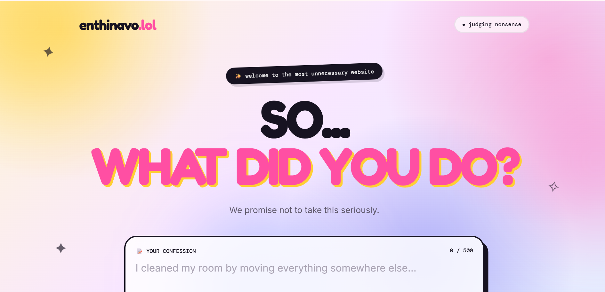
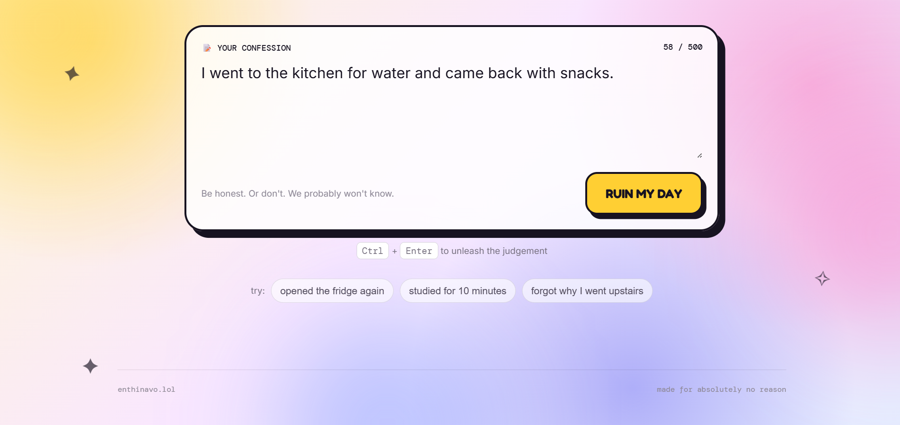
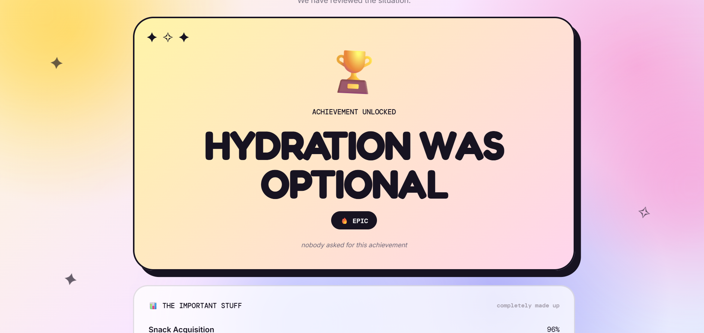
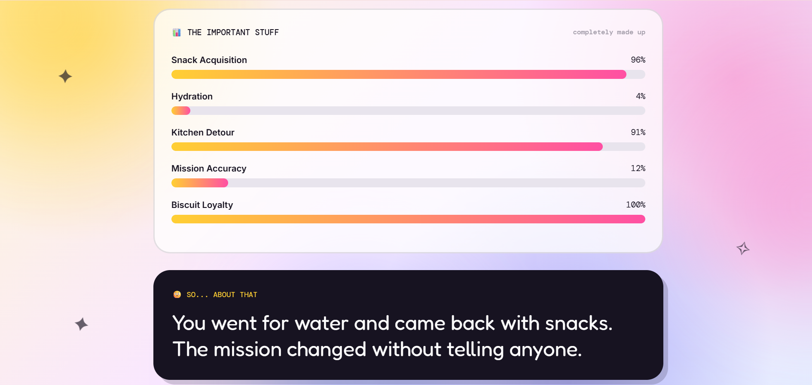
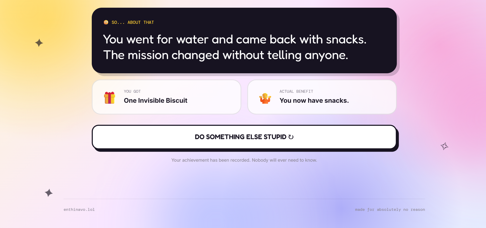
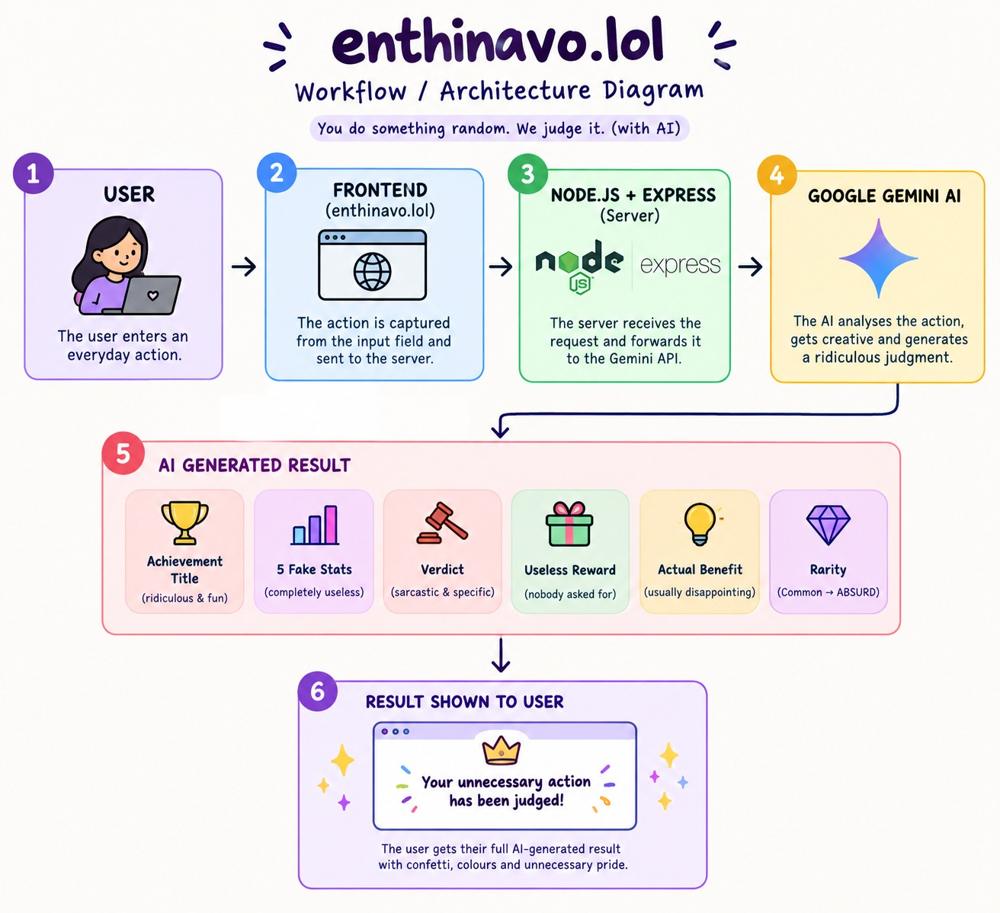

# enthinavo.lol 🎯

> A completely unnecessary AI judge for the things you do every day.

## Basic Details

### Team Name: Rubii

### Team Members

- Team Lead: Isha CS - Jawaharlal College of Engineering and Technology
- Member 2: S Roshini - Jawaharlal College of Engineering and Technology

## Project Description

**enthinavo.lol** is an AI-powered website that judges the completely unnecessary things you do every day.

Just tell it what you did, and it turns your action into a ridiculous achievement, five completely useless statistics, a sarcastic verdict, a useless reward, and an actual benefit that nobody asked for.

## The Problem (that doesn't exist)

People do random things every day and receive absolutely no recognition for them.

Going to the kitchen for water and returning with snacks?  
Opening your laptop to study and somehow reorganising your desktop?

These achievements deserve absolutely nothing.

So naturally, we built a system for them.

## The Solution (that nobody asked for)

**enthinavo.lol** uses AI to analyse everyday actions and dramatically overreact to them.

Enter what you did → click the judge button → receive:

- 🏆 A ridiculous achievement title
- 📊 Exactly 5 completely useless fake statistics
- ⚖️ A short and specific AI verdict
- 🎁 A useless reward
- 💡 An "Actual Benefit" that is usually disappointing
- ✨ A rarity level ranging from Common to ABSURD

Because apparently, this was necessary.

---

## Technical Details

### Technologies/Components Used

### For Software

- **Languages:** HTML, CSS, JavaScript
- **Framework:** Node.js, Express.js
- **AI:** Google Gemini API
- **Libraries:** Express, dotenv
- **Frontend:** Vanilla HTML, CSS and JavaScript
- **Tools:** VS Code, Git, GitHub, Command Prompt
- **API Communication:** REST API

### For Hardware

Not applicable — this is a software-only project and requires no additional hardware.

---

## Implementation

### For Software

# Installation

Clone the repository:

```bash
git clone <your-github-repository-link>
cd useless_project1
```

Install the required dependencies:

```bash
npm install
```

Create a `.env` file in the project root and add the Gemini API key:

```env
GEMINI_API_KEY=your_api_key_here
```

# Run

Start the server:

```bash
node server.js
```

Open the application in your browser:

```text
http://localhost:3000
```

---

## Project Documentation

### For Software

# Screenshots



*Landing page of enthinavo.lol where the user enters an everyday action.*



*Example of an everyday action submitted to the AI judge.*



*AI-generated achievement title and rarity based on the submitted action.*



*Five dynamically generated and completely useless statistics.*



*AI-generated verdict, useless reward and actual benefit.*

# Workflow / Architecture Diagram



*The workflow shows how the user's action moves from the frontend to the Node.js and Express server, which communicates with Google Gemini AI and returns the generated judgment to the user.*

---

## Project Demo

# Video
<video controls src="enthinavo.lol — You Did What_ - Google Chrome 2026-09-12 05-35-05.mp4" title="Title"></video>
A demonstration video will show the complete flow of enthinavo.lol — from entering an everyday action to receiving the AI-generated achievement, statistics, verdict and reward.

# Additional Demos

- Live Website: To be added
- GitHub Repository: To be added

---

## Team Contributions

- **Isha CS:** Contributed to the project idea, development, UI design, AI integration, testing and debugging.
- **S Roshini:** Contributed to the project idea, development, backend implementation, AI prompt design, testing and debugging.
- **Both members:** Worked together on the concept, implementation, testing, debugging, presentation and finalisation of the project.

---

## Why This Project Exists

It probably shouldn't.

But you typed something.

And we judged it.

That's enough.

---

Made with ❤️ at TinkerHub Useless Projects